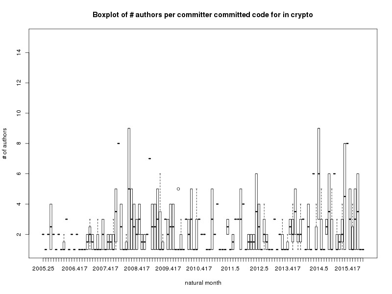

title: 基于开发日志的ASOP开发实践的度量和预测
speaker: 韩慧阳
url: https://github.com/ksky521/nodePPT
transition: cards
files: /js/demo.js,/css/demo.css

[slide]

# 基于开发日志的ASOP开发实践的度量和预测
###姓名：韩慧阳
###学号：2012011276
###导师：高性能所-陈康老师、软件所-陈渝老师

[slide]

#提纲 {:&.flexbox.vleft}
##目标重述
##论文研究进展
##个人进展
##后期安排

[slide]

#目标重述 {:&.flexbox.vleft}
- 根据openthos（in github）开发人员的gitlog日志文件/email等信息，分析人员与项目具体feature的关系，人员的活跃度等。
- 根据android-x86(in sourceforge)开发人员的gitlog日志文件/email等信息，分析人员与项目具体feature的关系，人员的活跃度等。
- 根据google内部人员开发的AOSP的gitlog日志文件预测新的安卓版本特性的改变, 人员与项目具体feature的关系，人员的活跃度等。

[slide]

#论文研究进展 {:&.flexbox.vleft}
- 研究背景的调研
	开源软件特性去留的关键影响因素:
	- 非性能缺陷（传统系统缺陷）
		- 可以被严格检测
		- 容易捕捉
		- 检测方法成熟
	- 性能缺陷（Performance Bugs） 
		- 不能被传统方式检测
		- 多数不影响系统的正确性
		- 强烈影响用户体验和软件表现

[slide]
#论文研究进展 {:&.flexbox.vleft}
性能缺陷的存在会影响到一个新的特性能否成功发布以及旧特性是否能继续留下
性能缺陷的检测、预测对于软件最终发行意义重大
- 主要的性能缺陷检测方法：
		- lkp-compare
		- Toddler
		- cache

[slide]

#个人进展 {:&.flexbox.vleft}
- linux-kernel贡献难度的分析
- linux kernel performance test

[slide]

#个人进展 {:&.flexbox.vleft}
- linux-kernel贡献难度的分析（原始数据的清洗与处理值得学习）
	- 重现
	- 结果分析展示

[slide]
	[结果1](pic/1.png) 

[slide]
	 

[slide]

#个人进展 {:&.flexbox.vleft}
-  linux kernel performance test
	- 数据抽取、清洗、聚类
		- 作用：方便处理，节约分析成本
		- 主要内容
			- 解析、抽取数据内容
			- 分辨、剔除不完整数据
			- 数据整合，补全
		- 结果展示
			4w+行、2k+列、补全数据使其所在列的均值和方差不变（后配图）
	

[slide]

#个人进展 {:&.flexbox.vleft}
-  linux kernel performance test
	- 降维（主成分分析）
		- 作用：凸显主要的影响因素
		- 主要内容：
			- 估计主成分个数
			- 提取主成分
			- 主成分意义的分析和解释

[slide]

#主成分意义的分析和解释 {:&.flexbox.vleft}
```
PC3
aim7.time.page_size 									0.81
time.page_size 										0.81
time.page_size	 									-0.17
time.elapsed_time										-0.50
aim7.real											0.32
time.involuntary_context_switches						0.13
aim7.time.elapsed_time	 							0.32
time.maximum_resident_set_size						0.06
aim7.time.percent_of_cpu_this_job_got					0.52
time.system_time										0.15
aim7.jti												0.80
aim7.jobs.per.min.per.task								0.73
aim7.time.maximum_resident_set_size					0.57
aim7.cpu												0.15
aim7.jobs.per.min										0.69
```
[slide]

#- 结果展示 {:&.flexbox.vleft}
dimensions 2000->20（跑完全部数据再修改
[slide]

#后期的安排 {:&.flexbox.vleft}

- 对比和分析三种性能缺陷检测方法的异同、优缺点（一周）
- 基于以上三种方法（或改进方法）总结性能缺陷在软件迭代中的作用（量化的）（一周）
- 参考之前提到的软件预测方法结合性能缺陷检测手段做分析和预测（两周到三周）